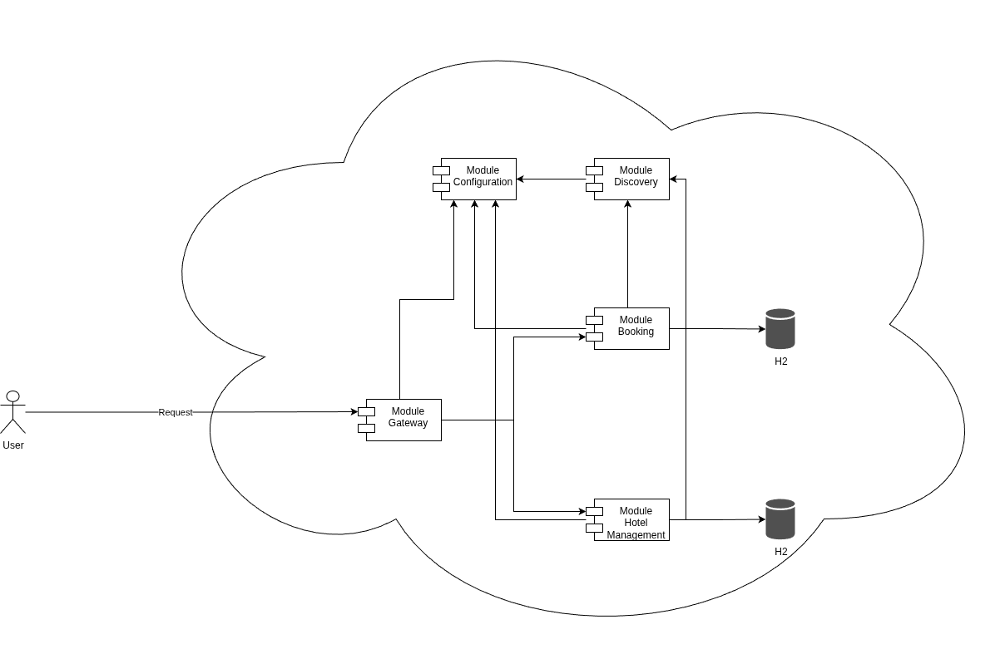

# Booking in spring cloud — Система бронирований отелей

Многомодульный проект распределённого приложения на Spring Boot/Cloud:
- Module Configuration (Spring Config Server)
- Module Gateway (Spring Cloud Gateway)
- Module Booking (JWT-аутентификация, бронирования, согласованность)
- Module Hotel Management (CRUD отелей и номеров, агрегаты по загруженности)
- Module Discovery (Eureka Server, Service Registry, динамическое обнаружение сервисов)

Все сервисы используют встроенную БД H2. 
Взаимодействие между сервисами выполняется как последовательность локальных транзакций (без глобальных распределённых транзакций).



## Возможности
- Регистрация и вход пользователей (JWT) через Booking Service
- Создание бронирований с двухшаговой согласованностью (`PENDING` → `CONFIRMED`/`CANCELLED` с компенсацией)
- Идемпотентность запросов с `requestId`
- Повторы с паузой и таймауты при удалённых вызовах (добавлен Retryer для OpenFeign)
- Подсказки по выбору номера (сортировка по `times_booked`)
- Администрирование пользователей (CRUD) и отелей/номеров (CRUD) для пользователей с правами администратора
- Агрегации: популярность номеров по `times_booked`

## Архитектура и порты
- `module-configuration`: порт 8888, это сервис конфигураций
- `module-discovery`: порт 8761, это Eureka
- `module-gateway`: порт 8080, это точка входа в приложение
- `module-booking`: порт 8081, регистрируется в Eureka под именем `module-booking`
- `module-hotel-management`: порт 8082, регистрируется в Eureka под именем `module-hotel-management`

Gateway маршрутизирует запросы к сервисам по их serviceId через Eureka и прокидывает заголовок `Authorization` с JWT токеном
После старта сервисы регистрируются в Eureka (`http://localhost:8761/eureka/`).

## Требования
- Java 17+
- Maven 3.9+

## Сборка и запуск
1) Собрать проект:
```bash
mvn clean package
```
2) Запустить при помощи docker-compose:
```bash
docker compose up --detach
```

## Конфигурация JWT
Используется симметричный ключ HMAC, секрет задаётся свойством `security.token.signing.key` в 
`module-configuration/src/main/resources/config/application.yml`, это свойство распространяется на конфигурации всех сервисов
Свойство `security.token.expiration.minutes` задает время жизни токена - 60 минут

## Быстрый сценарий (через Gateway на 8080)
1) Регистрация пользователя
```bash
curl -X POST http://localhost:8080/api/auth/sign/up \
  -H 'Content-Type: application/json' \
  -d '{
  "username": "Viktor",
  "password": "password123"
}'
```
2) Вход и получение JWT
```bash
TOKEN=$(curl -s -X POST "http://localhost:8080/api/auth/sign/in" \
  -H 'Content-Type: application/json' \
  -d '{
  "username": "root",
  "password": "password123"
}' | jq -r .token)
```
3) Создание отеля и номера (нужны права admin — можно зарегистрировать админа с `{"admin":true}` и войти под ним):
```bash
# пример запросов напрямую к Hotel через Gateway
curl -X POST http://localhost:8080/api/hotels/hotel \
  -H "Authorization: Bearer $TOKEN" \
  -H 'Content-Type: application/json' \
  -d '{"name": "Ананас"}'

# создать комнату.
curl -X POST http://localhost:8080/api/rooms/room \
  -H "Authorization: Bearer $TOKEN" \
  -H 'Content-Type: application/json' \
  -d '{"hotelId": 1, "number": "test"}'
```
4) Подсказки по номерам
```bash
curl -X GET http://localhost:8080/api/rooms/room/recommend-by-hotel/1 \
  -H "Authorization: Bearer $TOKEN" \
  -H 'Content-Type: application/json'
```
5) Создание бронирования (идемпотентный `requestId` обязателен):
```bash
curl -X POST http://localhost:8080/api/bookings/booking \
  -H "Authorization: Bearer $TOKEN" -H 'Content-Type: application/json' \
  -d '{
  "requestId": "123",
  "hotel": "Общага",
  "room": "313",
  "start": "23-10-2025",
  "finish": "24-10-2025"
}'
```
6) История бронирований пользователя
```bash
curl -X GET http://localhost:8080/api/bookings \
  -H "Authorization: Bearer $TOKEN" -H 'Content-Type: application/json' 
```

## Основные эндпойнты
Через Gateway (8080):
- Аутентификация (module-booking):
    - POST `/api/auth/sign/up` — регистрация пользователя
    - POST `api/auth/sign/in` — аутентификация и получение JWT
- Бронирования (module-booking):
    - GET `/api/bookings` — список бронирований пользователя
    - POST `/api/bookings/booking` — зарегистрировать бронирование (PENDING → CONFIRMED/компенсация)
    - GET `/api/bookings/booking/{id}` — бронирование пользователя по ID
    - DELETE `/api/bookings/booking/{id}` — удаление бронирования по ID (нужны права администратора)
- Пользователи (module-booking):
    - GET `/api/users` - список всех пользователей (нужны права администратора)
    - GET `/api/users/user/{id}` - информация о пользователе (нужны права администратора)
    - PUT `/api/users/user/{id}/set-admin` - добавить роль ADMIN пользователю (нужны права администратора)
    - DELETE `/api/users/user/{id}` - удаление пользователя (нужны права администратора)
- Отели и номера (module-hotel-management):
    - GET `/api/hotels` - список отелей
    - GET `/api/hotels/hotel/{id}` - информация о отеле по ID
    - GET `/api/hotels/hotel/find` - поиск отеля по названию
    - POST `/api/hotels/hotel` - сохранить отель (нужны права администратора)
    - DELETE `/api/hotels/hotel/{id}` - удалить отель (нужны права администратора)
    - GET `/api/rooms` - список апартаментов
    - GET `/api/rooms/room/{id}` - информация об апартаментах по ID
    - POST `/api/rooms/room` - сохранение апартаментов (нужны права администратора)
    - DELETE `/api/rooms/room/{id}` - удаление апартаментов (нужны права администратора)
    - GET `/api/rooms/find-by-hotel/{hotelId}` - поиск апартаментов по номеру и идентификатору отеля
    - GET `/api/rooms/room/recommend-by-hotel/{hotelId}` - получить список доступных апартаментов отеля
    - PUT `/api/rooms/room/{id}/set-available` - установка доступности апартаментов (нужны права администратора)
    - PUT `/api/rooms/room/{id}/unset-available` - отмена доступности апартаментов (нужны права администратора)
    - PUT `/api/rooms/room/{id}/confirm-availability` - установка брони апартаментов (идемпотентно по `requestId`)
    - DELETE `/api/rooms/room/{id}/release` - снятие брони апартаментов (идемпотентно по `requestId`)
- Статистика (module-hotel-management):
    - GET `/api/rooms/popular` — номера по популярности (количество бронирований)

## Согласованность и надёжность
- Локальные транзакции внутри каждого сервиса (`@Transactional`).
- Двухшаговый процесс бронирования: `PENDING` → `CONFIRMED`; при сбое → `CANCELLED`.
- Идемпотентность по `requestId` (повторные запросы не создают дубликаты и не меняют состояние повторно).
- Повторы с backoff и таймауты в удалённых вызовах к Hotel через `OpenFeign`.

## Консоль H2
- Включена для module-booking через прямой порт сервиса: `http://localhost:8081/h2-console`
- Включена для module-hotel-management через прямой порт сервиса: `http://localhost:8082/h2-console`

## Swagger / OpenAPI
- Booking Service UI: `http://localhost:8080/bookings/v3/api-docs/swagger-ui.html`
- Hotel Service UI: `http://localhost:8080/hotels/v3/api-docs/swagger-ui.html`
- Gateway (агрегация UI): `http://localhost:8080/swagger-ui.html` (переключатель спецификаций)

## Тестирование
- UserControllerTest - тестирование операций с пользователями
- BookingControllerTest - тестирование операций с бронированием
- HotelControllerTest - тестирование операций с отелями
- RoomControllerTest - тестирование операций с апартаментами
Каждый тест содержит проверку работы каждого эндпойнта, а также негативный сценарий

Запуск всех тестов:
```bash
mvn -q -DskipTests=false test
```

